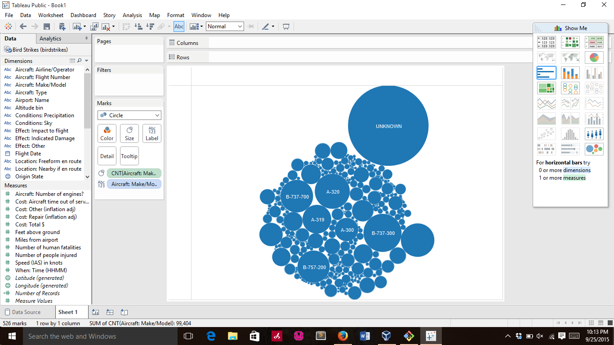

# Report

Using Tableau, create visualization for each question in the report regarding
bird strikes.

# Authors

This report is prepared by
* [Brian](https://github.com/co-bri/book)
* [Dian](https://github.com/boanding/book)
* [Matt S.](https://github.com/mattschroeder97/book)
* [Karen](https://github.com/kjblakemore/book)
* [Ming Liew](https://github.com/Malaokia/book)

# (Question 1)

Which airline have to incur most repair cost due to damage ? by Ming Liew

Picture of the repair cost

# (Question 2)
Which Airport has the highest number struck? by Brian

geographical location of the airline that cost the money

# (Question 3)
Which plane model strikes the most birds? by Matt

diff model of strikes on the bird

# (Question 4)

What state had the highest number of bird strikes?  By Dian

different number of bird

# (Question 5)

# (What airports have the most expensive average accident) by (Karen Blakemore)

3 different graph that indicate the average 
