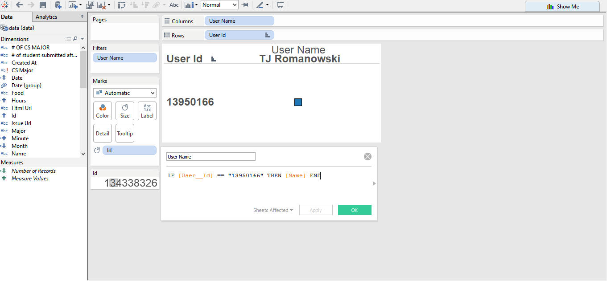
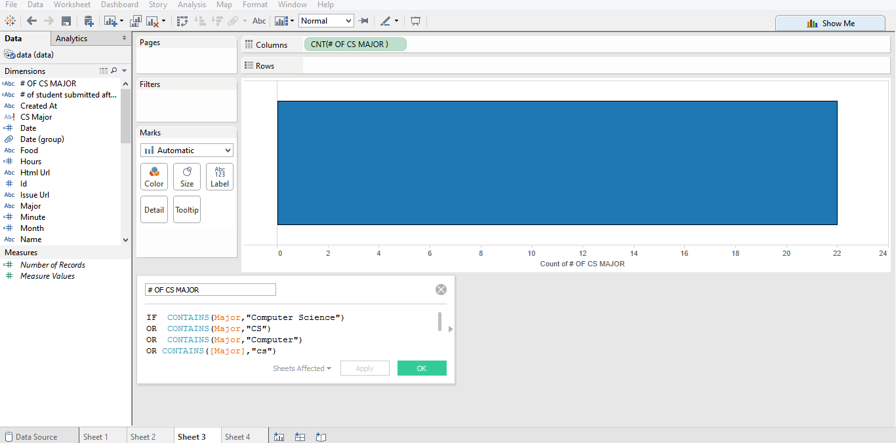
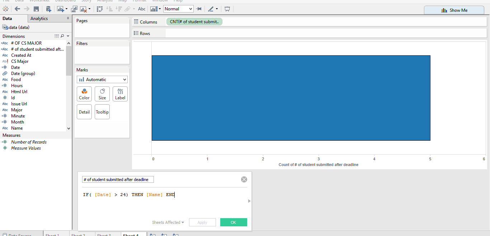

# Tableau Visualization

Tableau is arguably the biggest deal now in terms of data visualization for non-programmers.
Let's pretend you are not a programer. Learn and experience what it is like to make
visualizations using Tableau to answer the same questions about your classmates in our course.

For each of the question, think about what chart you should use to convey your answer and
make your best effort to create something that makes sense to you. There's no right
or wrong. When we meet in the class again, we will set aside time for each team to discuss
and compare the variety of visualization solutions each member has come up with for the
same set of questions. It will be fun!

To include a Tableau visualization in your report, take a screenshot, save it as an image,
put it in the `learning/week2` folder, and replace ``  with
your own image. Please makes sure your screenshot includes the _entire_ Tableau interface
including the controls, widgets ...etc.

# How big the deal Tableau really is?
data visualization able to describe information through visual rendering. It provided 
different perspective than the raw data, providing a visual insight into the data. Tableau will able to connect different data source and transform it to visually understandable data. Tableau allow compatibility across multiple platforms and capable of handling big data analysis.

# (Question 1)

THE ANSWER IS 21 SAME AS DOING WITH LODASH, AND IF YOU LOOK AT THE LONGER HORIZONTAL, IT CLEARLY SHOW IT IS 21.

# (Question 2)

IT SHOW THAT USER ID MATCH WITH THE USER NAME

# (Question 3)

I USE ANALYSIS CODE TO DO THE VARIABLE. YOU CAN SEE THAT THE BAR CHART CLEARLY SHOW IT IS 21
# (Question 4)

SAME AS THE FIRST QUESTION BUT I APPLY CODE THAT TAKE DATE THAT IS GREATER THAN 24