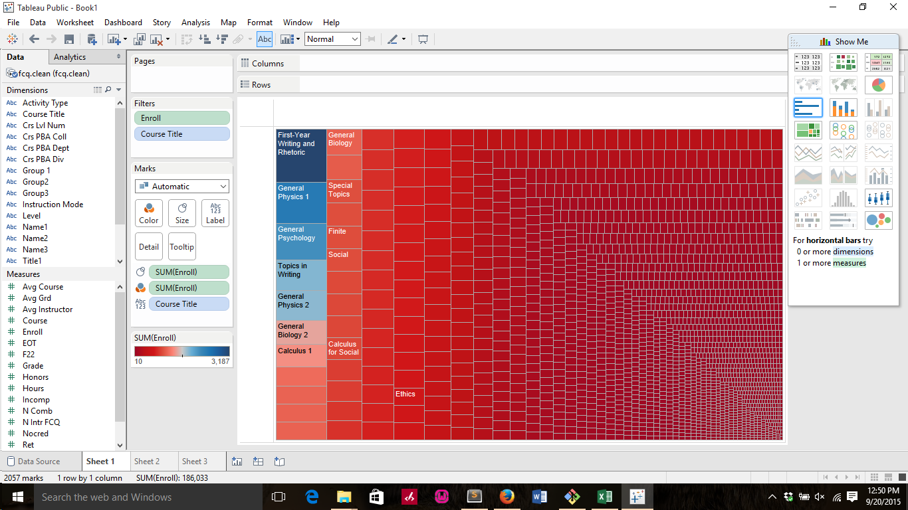
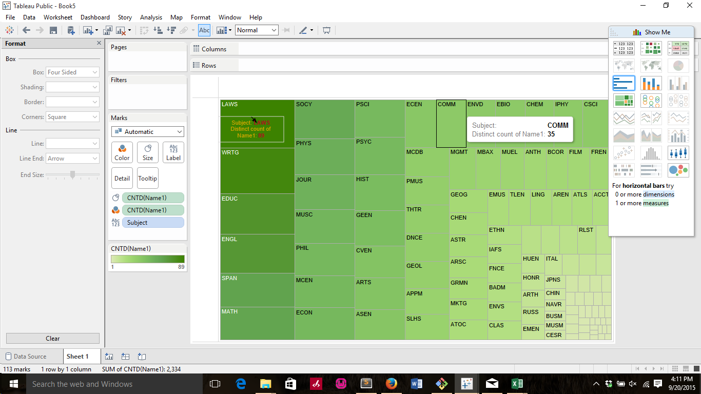
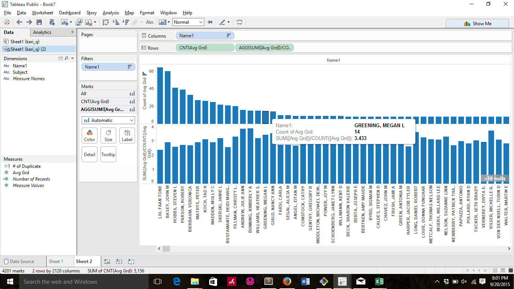
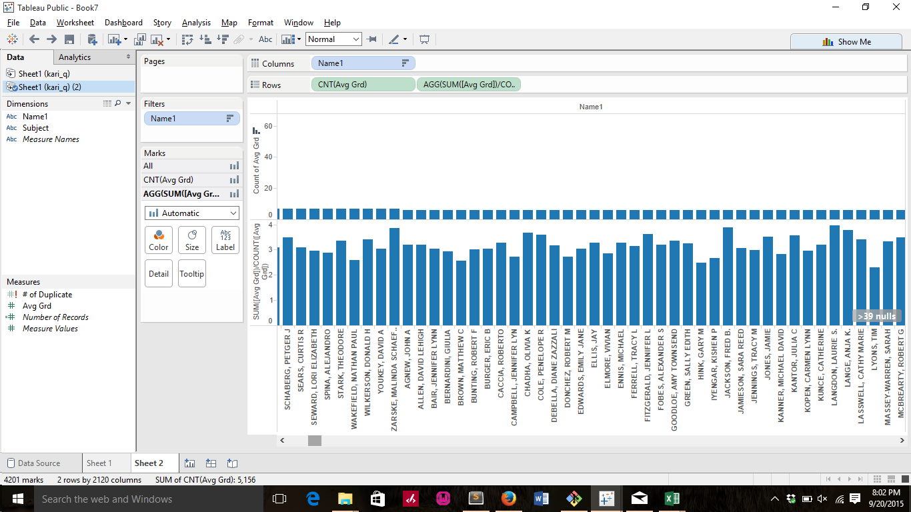
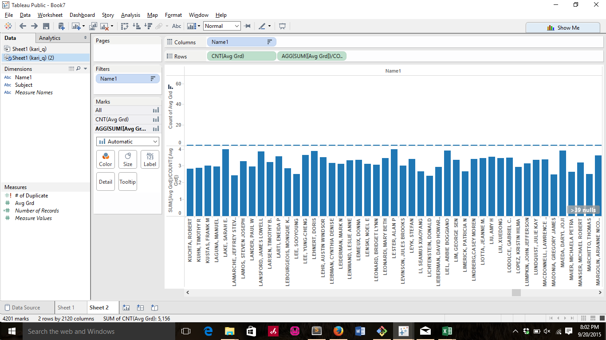
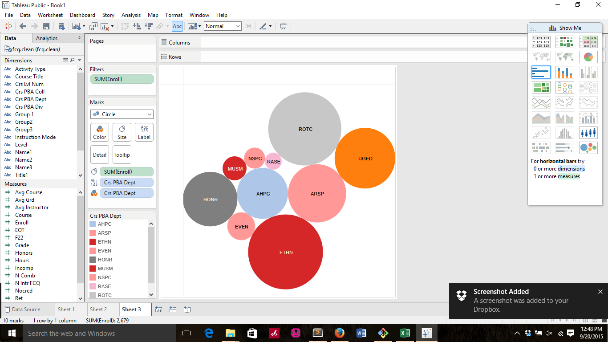
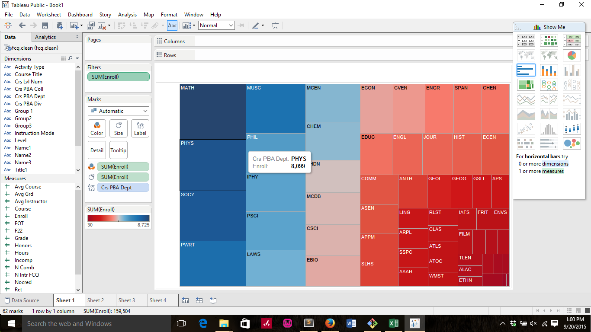

# Visualization

Using Tableau, create visualization for each question in the report. You will
work on this independently just like last week.

To include a Tableau visualization in your report, take a screenshot, save it as an image,
put it in the `learning/week2` folder, and replace ``  with
your own image. Please makes sure your screenshot includes the _entire_ Tableau interface
including the controls, widgets ...etc.

# Import

Data: [fcq.clean.json](https://github.com/bigdatahci2015/book/blob/master/hackathons/fcq/fcq.clean.json)

(a copy of this file is in your book repository already in the directory `hackathons/fcq`)

This dataset is provided to you in the JSON format. Your first task is to figure out
how to transform this JSON file into a format that can be fed into Tableau. As
a junior and senior, you are expected to be able to look around the Internet
to problem solve.

# Which course has the highest enrollment?  by Andrew

red indicate lower number of enrollment by each individual courses. Because of lapping course title, we can see that first year 
writing courses although has the only a few number per individual writing course, but the total enrollment that enrolled under
first year is enormous and is indicated through a dark blue color and the left hand corner.

# How many instructors have taught each subject?  by Kari 

so the largest area rectagular indicate the largest number of instructors in Laws subject.

# Does the instructors tends to give out higher grades if they teach more classes? or the reverse?  by Ming 

For this question i'm not able to obtain the full number because of complexity, but i'm able to obtain the average gpa per class,
At the left-most, it indicate the most classes, and the average gpa given by that teacher. But according to the previous answer in the report,
we know the trend is going down as classes increases.

# Which department has the lowest enrollment?  by John 

the light pink name RASE as the smaller bubble that indicate the minimum enrollment size because of simplicity i range the size of the enrollment down to 600. Thus we only
have only a few bubbles.

# Which subject is most in demand,based on the total number of enrollment?  by Sushant

Because in my excel I dont have "Subject" so i utilize the "course department", thus i change the range of the course department. As
we can see the dark plue indicate math department with the highest interest of the student. 
